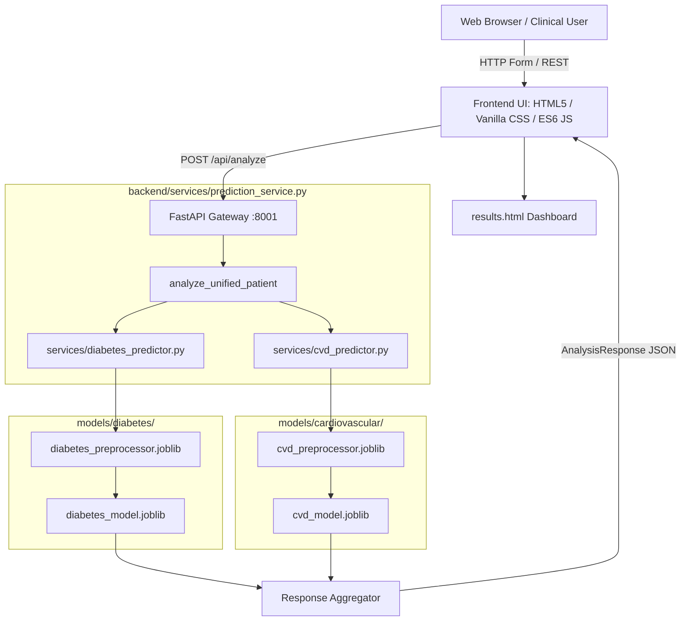

# AGENTS.md — I-HEART Project Context & Developer Guide

> **Authoritative Project Context**: This document serves as the permanent, authoritative project context, architectural blueprint, and development guide for the **I-HEART** system. All AI agents, contributors, and developers must read and adhere to this document before planning or executing any task in this repository.

---

## 1. Project Overview

- **Project Name:** I-HEART (Intelligent Health Evaluation And Risk Tracking)
- **Project Purpose:** A dual-disease clinical risk screening platform designed to assess patient vulnerability to both **Type 2 Diabetes** and **Cardiovascular Disease (CVD)** using advanced machine learning.
- **The Core Problem:** Traditional clinical workflows require independent, disjointed assessments and specialized questionnaires for different metabolic and cardiovascular conditions. This leads to duplicate data entry, practitioner fatigue, and fragmented risk visibility.
- **The Core Innovation (Unified Patient Input Architecture):** I-HEART eliminates multi-form fragmentation by establishing a single, comprehensive patient health profile intake contract. From this single record, specialized backend mappers isolate model-specific feature vectors, query independent machine learning pipelines, and synthesize dual risk probabilities into a single, cohesive clinical dashboard.

```
                              UNIFIED PATIENT RECORD
                   [Demographics, Vitals, Labs, Physical, Lifestyle]
                                        │
                    ┌───────────────────┴───────────────────┐
                    ▼                                       ▼
        [Diabetes Feature Mapper]               [CVD Feature Mapper]
                    │                                       │
        [Fitted Preprocessor]                   [Fitted Preprocessor]
                    │                                       │
        [Trained Diabetes Model]                [Trained CVD Model]
                    │                                       │
                    └───────────────────┬───────────────────┘
                                        ▼
                           UNIFIED RISK DASHBOARD
```

---

## 2. Current Architecture

The I-HEART repository is organized into a modular three-tier architecture: **Frontend**, **FastAPI Backend**, and **Machine Learning Layer**.



### 2.1 Layer Breakdown
1. **Frontend Tier ([frontend/](file:///e:/projects/I-HEART/frontend)):**
   - Pure Vanilla Web stack (HTML5 semantic structure, CSS3 custom design system with dark clinical theme, ES6+ JavaScript modules).
   - Zero heavyweight client frameworks (no React/Next.js/Tailwind).
   - Pages: Landing page ([index.html](file:///e:/projects/I-HEART/frontend/index.html)), Unified intake form ([assessment.html](file:///e:/projects/I-HEART/frontend/assessment.html)), Risk dashboard ([results.html](file:///e:/projects/I-HEART/frontend/results.html)).
   - Served directly by FastAPI from `http://127.0.0.1:8001/` (Unified Host Architecture).

2. **Backend API Tier ([backend/](file:///e:/projects/I-HEART/backend)):**
   - High-performance asynchronous FastAPI service in [backend/app.py](file:///e:/projects/I-HEART/backend/app.py).
   - Standard execution port: `8001` via Uvicorn (`http://127.0.0.1:8001`).
   - Serves both frontend static assets/pages (`/`, `/assessment.html`, `/results.html`) and backend API endpoints (`/api/health`, `/api/analyze`, `/docs`) on a single port.
   - CORS middleware enabled for cross-origin local execution (`*`).
   - Strict request and response data contracts validated using Pydantic models in [backend/schemas.py](file:///e:/projects/I-HEART/backend/schemas.py).

3. **Machine Learning Tier ([ml/](file:///e:/projects/I-HEART/ml) & [models/](file:///e:/projects/I-HEART/models)):**
   - Independent preprocessing scripts, model training routines, and serialized artifacts.
   - Dual scikit-learn classification models and preprocessors saved using `joblib`.
   - Feature mappers converting the unified patient schema to exact tabular feature columns.

### 2.2 Model and Preprocessing Files
- **Diabetes:**
  - Model: [models/diabetes/diabetes_model.joblib](file:///e:/projects/I-HEART/models/diabetes/diabetes_model.joblib)
  - Preprocessor: [models/diabetes/diabetes_preprocessor.joblib](file:///e:/projects/I-HEART/models/diabetes/diabetes_preprocessor.joblib)
  - Metadata & Metrics: [models/diabetes/metadata.json](file:///e:/projects/I-HEART/models/diabetes/metadata.json)
- **Cardiovascular Disease:**
  - Model: [models/cardiovascular/cvd_model.joblib](file:///e:/projects/I-HEART/models/cardiovascular/cvd_model.joblib)
  - Preprocessor: [models/cardiovascular/cvd_preprocessor.joblib](file:///e:/projects/I-HEART/models/cardiovascular/cvd_preprocessor.joblib)
  - Metadata & Metrics: [models/cardiovascular/metadata.json](file:///e:/projects/I-HEART/models/cardiovascular/metadata.json)

### 2.3 Current End-to-End Data Flow
1. **Data Capture:** User enters patient demographic, vitals, physical measurements, lab values, and lifestyle factors in [frontend/assessment.html](file:///e:/projects/I-HEART/frontend/assessment.html). BMI is calculated automatically in real time.
2. **Client Validation:** [frontend/js/assessment.js](file:///e:/projects/I-HEART/frontend/js/assessment.js) performs client-side field validation, compiles the 6 categories into a nested JSON structure matching `UnifiedPatientProfile`.
3. **API Dispatch:** Front-end sends `POST http://127.0.0.1:8001/api/analyze` with the JSON payload.
4. **Backend Ingestion:** FastAPI parses and validates the payload with [backend/schemas.py](file:///e:/projects/I-HEART/backend/schemas.py).
5. **Concurrent Feature Mapping:** [backend/services/prediction_service.py](file:///e:/projects/I-HEART/backend/services/prediction_service.py) invokes:
   - [backend/services/diabetes_predictor.py](file:///e:/projects/I-HEART/backend/services/diabetes_predictor.py): extracts 8 diabetes features.
   - [backend/services/cvd_predictor.py](file:///e:/projects/I-HEART/backend/services/cvd_predictor.py): extracts 11 CVD features.
6. **Inference Execution:**
   - Both services lazily load preprocessors and models from `models/` on first call.
   - Preprocessors transform feature vectors (`ColumnTransformer.transform`).
   - Models run `predict_proba` to compute class probabilities and risk percentages (1–99%).
   - Risk bands assigned: `Low` (<35%), `Moderate` (35–69%), `High` (>=70% or predicted class 1).
   - Contributing factors identified via clinical thresholds.
7. **Response Aggregation:** Backend packs results into `AnalysisResponse` containing patient profile, diabetes prediction, and CVD prediction.
8. **Client Presentation:** Front-end receives JSON, caches it in `sessionStorage` (`current_health_analysis`), redirects to [frontend/results.html](file:///e:/projects/I-HEART/frontend/results.html), and dynamically renders risk meters, badges, and contributing factors.

---

## 3. ML System

### 3.1 Datasets and Provenance
- **Diabetes Dataset:** [datasets/diabetes/raw/diabetes_prediction_dataset.csv](file:///e:/projects/I-HEART/datasets/diabetes/raw/diabetes_prediction_dataset.csv) (30,000 records). 84.5% non-diabetic (`0`), 15.5% diabetic (`1`).
- **CVD Dataset:** [datasets/cardiovascular/raw/cardiovascular_dataset.csv](file:///e:/projects/I-HEART/datasets/cardiovascular/raw/cardiovascular_dataset.csv) (30,000 records). 60.7% no CVD (`0`), 39.3% CVD (`1`).
- Benchmark ingestion script: [datasets/download_datasets.py](file:///e:/projects/I-HEART/datasets/download_datasets.py).

### 3.2 Preprocessing Approach & Leakage Prevention
Both pipelines adhere to strict data-leakage safeguards:
- **Stratified Splitting:** 80% train (24,000 samples) / 20% test (6,000 samples) stratified on the disease target (`random_state=42`).
- **Fit on Train Only:** `ColumnTransformer.fit_transform()` is executed exclusively on `X_train`. The test set and inference requests are transformed using `.transform()` only.
- **Transformers Used:**
  - *Numerical Features:* `Pipeline(SimpleImputer(strategy='median'), StandardScaler())`
  - *Categorical Features:* `Pipeline(SimpleImputer(strategy='most_frequent'), OneHotEncoder(handle_unknown='ignore', sparse_output=False))`

### 3.3 Feature Specifications
| Pipeline | Raw Feature Inputs | Transformed Dims | Key Factors |
| :--- | :--- | :--- | :--- |
| **Diabetes** | `gender`, `age`, `hypertension`, `heart_disease`, `smoking_history`, `bmi`, `HbA1c_level`, `blood_glucose_level` | 17 columns | Fasting glucose, HbA1c, BMI, age, hypertension |
| **Cardiovascular** | `age`, `gender`, `height`, `weight`, `ap_hi`, `ap_lo`, `cholesterol`, `gluc`, `smoke`, `alco`, `active` | 19 columns | Systolic/diastolic BP, cholesterol, glucose, smoking, age |

### 3.4 Candidate Algorithms & Evaluation
Four supervised classification algorithms were benchmarked using 5-Fold Stratified Cross-Validation on the 24,000-sample training sets:
1. `LogisticRegression(class_weight='balanced', max_iter=1000)`
2. `RandomForestClassifier(n_estimators=100, max_depth=10, class_weight='balanced')`
3. `GradientBoostingClassifier(n_estimators=100, learning_rate=0.1, max_depth=4)`
4. `HistGradientBoostingClassifier(class_weight='balanced', max_iter=100)`

#### Benchmark Results (5-Fold CV on Training Set):
- **Diabetes:**
  - Logistic Regression: Accuracy: 0.7423 | Precision: 0.3481 | **Recall: 0.7530** | F1: 0.4761 | **ROC-AUC: 0.8278**
  - Random Forest: Accuracy: 0.7709 | Precision: 0.3731 | Recall: 0.6949 | F1: 0.4854 | ROC-AUC: 0.8204
  - Gradient Boosting: Accuracy: 0.8625 | Precision: 0.6301 | Recall: 0.2826 | F1: 0.3900 | ROC-AUC: 0.8236
  - HistGradient Boosting: Accuracy: 0.7520 | Precision: 0.3556 | Recall: 0.7316 | F1: 0.4785 | ROC-AUC: 0.8224
- **Cardiovascular Disease:**
  - Logistic Regression: Accuracy: 0.6858 | Precision: 0.5863 | **Recall: 0.6850** | F1: 0.6318 | **ROC-AUC: 0.7497**
  - Random Forest: Accuracy: 0.6830 | Precision: 0.5875 | Recall: 0.6525 | F1: 0.6183 | ROC-AUC: 0.7407
  - Gradient Boosting: Accuracy: 0.6975 | Precision: 0.6513 | Recall: 0.4979 | F1: 0.5643 | ROC-AUC: 0.7430
  - HistGradient Boosting: Accuracy: 0.6835 | Precision: 0.5863 | Recall: 0.6647 | F1: 0.6230 | ROC-AUC: 0.7430

### 3.5 Model Selection Rationale
In clinical screening, false negatives must be minimized (missing an at-risk individual carries severe clinical cost). Therefore, models were selected by prioritizing **Recall (Sensitivity)** and **ROC-AUC**. Balanced Logistic Regression achieved the highest CV ROC-AUC and top Recall for both conditions, while also providing smooth, calibrated probability scores and linear interpretability ready for SHAP explainability.

### 3.6 Final Hyperparameter Tuning & Test Set Metrics (6,000 Untouched Samples)
Hyperparameter optimization via `GridSearchCV` (`scoring='roc_auc'`):
- **Diabetes Final Model:** `LogisticRegression(C=0.01, solver='liblinear', class_weight='balanced')`
  - Accuracy: `0.7455` | Precision: `0.3548` | **Recall: `0.7781`** | F1: `0.4874` | **ROC-AUC: `0.8354`**
- **CVD Final Model:** `LogisticRegression(C=0.1, solver='lbfgs', class_weight='balanced')`
  - Accuracy: `0.6843` | Precision: `0.5854` | **Recall: `0.6777`** | F1: `0.6282` | **ROC-AUC: `0.7470`**

### 3.7 Storage of Trained Artifacts
- **Models Directory:** [models/diabetes/](file:///e:/projects/I-HEART/models/diabetes) and [models/cardiovascular/](file:///e:/projects/I-HEART/models/cardiovascular)
- Model artifacts: `diabetes_model.joblib`, `cvd_model.joblib`
- Preprocessor artifacts: `diabetes_preprocessor.joblib`, `cvd_preprocessor.joblib`
- Metadata: `metadata.json` documenting timestamps, features, hyperparameters, CV scores, confusion matrices, and leakage checks.

---

## 4. Backend

### 4.1 Structure
The backend is structured under [backend/](file:///e:/projects/I-HEART/backend):
- [backend/app.py](file:///e:/projects/I-HEART/backend/app.py): Application entry point, CORS config, route definitions.
- [backend/schemas.py](file:///e:/projects/I-HEART/backend/schemas.py): Pydantic V2 schemas for typed inputs/outputs.
- [backend/integration/](file:///e:/projects/I-HEART/backend/integration): Hospital / EMR Integration Foundation layer.
  - [backend/integration/emr_schemas.py](file:///e:/projects/I-HEART/backend/integration/emr_schemas.py): EMR payload data contracts (`MockEMRPayload`).
  - [backend/integration/emr_adapter.py](file:///e:/projects/I-HEART/backend/integration/emr_adapter.py): Normalization and adaptation to canonical `UnifiedPatientProfile`.
  - [backend/integration/emr_service.py](file:///e:/projects/I-HEART/backend/integration/emr_service.py): Privacy-safe EMR ingestion & prediction routing.
- [backend/services/prediction_service.py](file:///e:/projects/I-HEART/backend/services/prediction_service.py): High-level orchestrator calling individual disease services.
- [backend/services/diabetes_predictor.py](file:///e:/projects/I-HEART/backend/services/diabetes_predictor.py): Diabetes feature mapping, model execution, factor derivation.
- [backend/services/cvd_predictor.py](file:///e:/projects/I-HEART/backend/services/cvd_predictor.py): CVD feature mapping, model execution, factor derivation.
- [backend/requirements.txt](file:///e:/projects/I-HEART/backend/requirements.txt): Python dependencies (`fastapi`, `uvicorn`, `scikit-learn`, `pandas`, `numpy`, `scipy`, `joblib`).

### 4.2 API Endpoints
| HTTP Method | Endpoint | Request Schema | Response Schema | Purpose |
| :--- | :--- | :--- | :--- | :--- |
| `GET` | `/api/health` | None | `{"status": str, "message": str}` | System liveness / operational health check |
| `POST` | `/api/analyze` | `UnifiedPatientProfile` | `AnalysisResponse` | Single patient intake returning dual risk predictions |
| `POST` | `/api/emr/analyze` | `MockEMRPayload` | `AnalysisResponse` | Hospital/EMR patient intake normalized to unified risk predictions |
| `POST` | `/api/emr/test` | `MockEMRPayload` | `AnalysisResponse` | Dedicated test endpoint for EMR integration validation |

### 4.3 Request Handling & Schema Contract
Incoming requests to `POST /api/analyze` must adhere to `UnifiedPatientProfile`:
```json
{
  "patient_id": "PAT-2026-001",
  "demographics": { "age": 52, "gender": "Male" },
  "physical": { "height_cm": 175.0, "weight_kg": 82.0, "bmi": 26.8 },
  "vitals": { "systolic_bp": 138, "diastolic_bp": 88, "heart_rate": 74 },
  "laboratory": {
    "glucose": 115.0,
    "hba1c": 6.1,
    "total_cholesterol": 210.0,
    "hdl": 45.0,
    "ldl": 135.0,
    "triglycerides": 150.0
  },
  "lifestyle": {
    "smoking": "Current",
    "physical_activity": "Moderate",
    "alcohol": "Moderate"
  },
  "medical_history": {
    "hypertension": true,
    "existing_diabetes": false,
    "family_history_diabetes": true,
    "family_history_cvd": true
  }
}
```

### 4.4 Communication Between Frontend and Backend
- Protocol: REST over HTTP/1.1 with JSON payloads.
- Default Host & Port: `http://127.0.0.1:8001` (configured via `API_BASE_URL` in [frontend/js/assessment.js](file:///e:/projects/I-HEART/frontend/js/assessment.js) and [frontend/js/app.js](file:///e:/projects/I-HEART/frontend/js/app.js)).
- Error Handling: Returns HTTP 422 for schema validation errors; HTTP 500 with descriptive detail if an inference pipeline error occurs.

---

## 5. Frontend

### 5.1 Architecture & Structure
The frontend is located in [frontend/](file:///e:/projects/I-HEART/frontend):
- HTML Pages:
  - [frontend/index.html](file:///e:/projects/I-HEART/frontend/index.html): Landing page with project overview, core methodology, live API ping badge, and links.
  - [frontend/assessment.html](file:///e:/projects/I-HEART/frontend/assessment.html): Single comprehensive intake form.
  - [frontend/results.html](file:///e:/projects/I-HEART/frontend/results.html): Dynamic visual dashboard displaying patient stats, animated risk gauges, and factor attributions.
- Styling:
  - [frontend/css/style.css](file:///e:/projects/I-HEART/frontend/css/style.css): Complete custom design system (~37KB). Features dark clinical color tokens, glassmorphism cards, CSS grid layouts, and responsive media queries.
- JavaScript Modules:
  - [frontend/js/app.js](file:///e:/projects/I-HEART/frontend/js/app.js): Header navigation, hamburger menu, and live backend health polling (`GET /api/health`).
  - [frontend/js/assessment.js](file:///e:/projects/I-HEART/frontend/js/assessment.js): Interactive real-time BMI calculator, form validation, demo profile loaders (Moderate / High risk), JSON building, and submission.
  - [frontend/js/results.js](file:///e:/projects/I-HEART/frontend/js/results.js): Deserializes session analysis, animates risk meter bars, applies risk level color coding, and renders clinical factor badges.

### 5.2 Patient Input Flow
1. Patient or clinician enters data into 6 grouped cards in `assessment.html`:
   - Section 1: Demographics (`patient_id`, `age`, `gender`)
   - Section 2: Physical Measurements (`height_cm`, `weight_kg` -> triggers real-time BMI calculation & category pill)
   - Section 3: Vital Signs (`systolic_bp`, `diastolic_bp`, `heart_rate`)
   - Section 4: Laboratory Tests (`glucose`, optional `hba1c`, `total_cholesterol`, `hdl`, `ldl`, `triglycerides`)
   - Section 5: Lifestyle (`smoking`, `physical_activity`, `alcohol`)
   - Section 6: Medical History (`hypertension`, `family_history_diabetes`, `family_history_cvd`)
2. Demo Autofill: "Load Moderate Risk Sample" and "Load High Risk Sample" allow rapid demonstration without manual entry.
3. Form validation verifies numeric ranges, required selections, and displays inline error messages.

### 5.3 Results / Dashboard Flow
1. Upon successful API response, the full payload is committed to browser `sessionStorage` under `current_health_analysis`.
2. Browser navigates to `results.html`.
3. If no active session exists, an empty state card prompts the user to start a new assessment.
4. Active analysis displays:
   - Patient Summary Header (ID, demographic tags, core vitals).
   - Diabetes Risk Card: Percentage meter (0–100%), categorical badge (`Low`/`Moderate`/`High`), clinical summary note, and contributing risk factors.
   - Cardiovascular Risk Card: Percentage meter (0–100%), categorical badge (`Low`/`Moderate`/`High`), clinical summary note, and contributing risk factors.
   - Clinical Disclaimer & Action Buttons ("New Assessment", "Print / Export").

---

## 6. Project Structure

```
e:\projects\I-HEART\
├── AGENTS.md                          # Authoritative project context and agent instructions
├── .gitignore                         # Git exclusion rules
├── backend/                           # FastAPI backend service
│   ├── app.py                         # Application entrypoint & HTTP routes
│   ├── requirements.txt               # Backend dependencies
│   ├── schemas.py                     # Pydantic data schemas
│   ├── integration/                   # Hospital / EMR Integration Foundation
│   │   ├── __init__.py                # Integration package initializer
│   │   ├── emr_schemas.py             # EMR payload data contracts (MockEMRPayload)
│   │   ├── emr_adapter.py             # Normalization to UnifiedPatientProfile
│   │   └── emr_service.py             # Privacy-safe EMR ingestion & pipeline routing
│   └── services/                      # Business logic & ML inference services
│       ├── __init__.py                # Package initializer
│       ├── cvd_predictor.py           # CVD feature mapper and predictor
│       ├── diabetes_predictor.py      # Diabetes feature mapper and predictor
│       └── prediction_service.py      # Dual prediction orchestrator
├── datasets/                          # Dataset storage and ingestion
│   ├── README.md                      # Dataset documentation summary
│   ├── download_datasets.py           # Benchmark dataset generation & validation
│   ├── cardiovascular/                # CVD dataset splits
│   │   ├── raw/cardiovascular_dataset.csv
│   │   └── processed/                 # Train/test CSV splits
│   └── diabetes/                      # Diabetes dataset splits
│       ├── raw/diabetes_prediction_dataset.csv
│       └── processed/                 # Train/test CSV splits
├── docs/                              # Project technical documentation
│   ├── AGENTS_SETUP_REVIEW.md         # Context creation audit & verification report
│   ├── EMR_INTEGRATION_REVIEW.md      # Hospital / EMR integration foundation report
│   ├── LOCAL_HOST_MERGE_REVIEW.md     # Single-port localhost consolidation report
│   ├── feature_mapping.md             # Detailed schema-to-feature mapping reference
│   ├── ml_architecture.md             # ML system architectural flow & principles
│   ├── model_evaluation.md            # Benchmark cross-validation & test metrics
│   ├── training_pipeline.md           # Reproducible training pipeline steps
│   └── datasets/                      # Individual dataset documentation
│       ├── cardiovascular_dataset.md  # CVD dataset provenance & attributes
│       └── diabetes_dataset.md        # Diabetes dataset provenance & attributes
├── frontend/                          # Web client interface
│   ├── index.html                     # Landing & project overview page
│   ├── assessment.html                # Unified patient intake form
│   ├── results.html                   # Dual health risk dashboard
│   ├── css/
│   │   └── style.css                  # Design system, layout, dark theme tokens
│   └── js/
│       ├── app.js                     # Global UI & backend health monitoring
│       ├── assessment.js              # Intake form validation & API dispatch
│       └── results.js                 # Dashboard visualization & animations
├── ml/                                # Machine learning training & evaluation code
│   ├── cardiovascular/                # CVD ML pipeline scripts
│   │   ├── evaluate.py                # CVD test set evaluation & report
│   │   ├── predict.py                 # Standalone CLI inference runner
│   │   ├── preprocess.py              # Preprocessing pipeline & column transformer
│   │   └── train.py                   # 5-fold CV, tuning, artifact serialization
│   └── diabetes/                      # Diabetes ML pipeline scripts
│       ├── evaluate.py                # Diabetes test set evaluation & report
│       ├── predict.py                 # Standalone CLI inference runner
│       ├── preprocess.py              # Preprocessing pipeline & column transformer
│       └── train.py                   # 5-fold CV, tuning, artifact serialization
├── models/                            # Serialized model artifacts & metadata
│   ├── README.md                      # Models directory documentation
│   ├── cardiovascular/                # Saved CVD model artifacts
│   │   ├── cvd_model.joblib           # Trained Logistic Regression classifier
│   │   ├── cvd_preprocessor.joblib    # Fitted ColumnTransformer preprocessor
│   │   └── metadata.json              # Full training metadata & metrics
│   └── diabetes/                      # Saved Diabetes model artifacts
│       ├── diabetes_model.joblib      # Trained Logistic Regression classifier
│       ├── diabetes_preprocessor.joblib # Fitted ColumnTransformer preprocessor
│       └── metadata.json              # Full training metadata & metrics
├── notebooks/                         # Jupyter experimentation notebooks
│   └── README.md                      # Roadmap for EDA & SHAP notebooks
└── tests/                             # Automated testing & scenario validation (84 tests, 8 suites)
    ├── run_all_tests.py               # Master automated test suite runner
    ├── test_ml_pipeline.py            # 11 tests for ML loading, feature mapping, probabilities
    ├── test_validation.py             # 22 tests for boundaries, types, BMI & BP consistency
    ├── test_api_endpoints.py          # 16 tests for HTTP routes, docs, and server stability
    ├── test_xai.py                    # 12 tests for factor attribution & failure resilience
    ├── test_emr_integration.py        # 10 tests for EMR schemas, adapter, and normalization
    ├── test_scenarios_e2e.py          # 6 tests for end-to-end clinical scenarios (A through F)
    ├── test_security_privacy.py       # 6 tests for PHI protection, gitignore, and path shielding
    └── verify_scenarios.py            # Multi-scenario clinical verification runner
```

---

## 7. Current Project Status

### 7.1 Completed Functionality
- [x] **Unified Intake Architecture:** Standardized 6-category clinical intake schema with single patient entry.
- [x] **Benchmark Datasets:** 30,000 raw samples each for Diabetes and CVD with documented clinical distribution.
- [x] **Leakage-Safe Preprocessing:** Preprocessor pipelines fitted exclusively on training splits with numerical median imputation and categorical one-hot encoding.
- [x] **Model Benchmarking:** 5-Fold Stratified Cross-Validation across 4 candidate algorithms for each disease.
- [x] **Hyperparameter Optimization:** `GridSearchCV` tuning of regularization parameters.
- [x] **Model Serialization:** Final calibrated models, preprocessors, and `metadata.json` saved in `models/`.
- [x] **FastAPI Gateway:** Operational backend with CORS, `/api/health`, and `/api/analyze`.
- [x] **Dual Feature Mapping:** Isolated mappers extracting model-specific vectors from `UnifiedPatientProfile`.
- [x] **Frontend Web Interface:** Complete 3-screen responsive interface with dark clinical styling, real-time BMI calculator, and sample demo loaders.
- [x] **Results Dashboard:** Dual percentage meters, risk badges, and factor attribution displays.
- [x] **Single Localhost Port Consolidation:** Unified serving of frontend static files and API routes on port 8001.
- [x] **Hospital / EMR Integration Foundation:** EMR schemas (`MockEMRPayload`), `EMRAdapter` normalization, test endpoints (`/api/emr/analyze`, `/api/emr/test`), and automated test suite ([tests/test_emr_integration.py](file:///e:/projects/I-HEART/tests/test_emr_integration.py)).
- [x] **Input Validation & Biological Boundary Hardening:** Enforced physiological ranges, biological BMI consistency checks ($>5.0$ discrepancy rejected), and hemodynamic relationship validation ($DBP < SBP$) across `schemas.py` and `emr_schemas.py`.
- [x] **Security & Privacy Hardening:** Sealed logger outputs against emitting clinical PHI, protected environment and secret patterns in `.gitignore`, and prevented local server directory leakage in error responses.
- [x] **Comprehensive Testing & Validation (Step 4):** 84 automated tests across 8 suites covering ML models, schemas, REST endpoints, XAI resilience, EMR adapter, E2E scenarios (A–F), and security (100% passing, 0 regressions, documented in [docs/TESTING_VALIDATION_REVIEW.md](file:///e:/projects/I-HEART/docs/TESTING_VALIDATION_REVIEW.md)).

### 7.2 Functionality Currently in Progress
- [ ] **Transition from Heuristic to Algorithmic Attribution:** Replacing preliminary clinical threshold factor notes with exact model-derived weights and SHAP calculations.
- [ ] **Exploratory Data Analysis Notebooks:** Authoring structured Jupyter notebooks in `notebooks/` to accompany research papers.

### 7.3 Remaining Functionality
- [ ] **Live Hospital / External EHR FHIR Connector:** Live production network adapter connecting to live hospital databases or HL7 FHIR servers.
- [ ] **Explainable AI (XAI) Integration:** SHAP TreeExplainer/LinearExplainer pipeline producing waterfall plots and global feature rankings.
- [ ] **Production Database Persistence:** Relational database persistence (e.g. PostgreSQL with SQLAlchemy) for historical screening audits.
- [ ] **Batch Patient Analysis:** Multi-patient CSV upload and bulk screening endpoint.
- [ ] **Mobile & Progressive Web App (PWA):** Touch-optimized mobile layout and offline-ready service worker.
- [ ] **Production Deployment:** Docker containerization, reverse proxy configs (Nginx), CI/CD workflows, and production SSL.
- [ ] **Explainable AI (XAI) Integration:** SHAP TreeExplainer/LinearExplainer pipeline producing waterfall plots and global feature rankings.
- [ ] **Hospital / EMR / EHR Integration:** HL7 FHIR standard patient resource ingestion and database persistence (PostgreSQL/SQLite).
- [ ] **Batch Patient Analysis:** Multi-patient CSV upload and bulk screening endpoint.
- [ ] **Mobile & Progressive Web App (PWA):** Touch-optimized mobile layout and offline-ready service worker.
- [ ] **Production Deployment:** Docker containerization, reverse proxy configs (Nginx), CI/CD workflows, and production SSL.

---

## 8. Development Rules

All agents and contributors must strictly enforce the following rules:

1. **`AGENTS.md` is the Authoritative Context:** This file is the primary source of truth regarding system architecture, data contracts, and project status.
2. **Read `AGENTS.md` First:** Before planning or implementing any task, consult `AGENTS.md`. Do not start by guessing or assuming external dependencies.
3. **Avoid Unnecessary Repository Re-Analysis:** Do NOT inspect or scan every file in the repository for every user prompt. Rely on `AGENTS.md` for context.
4. **Targeted File Inspection:** Only view or inspect additional source files when they are directly relevant to the specific task at hand.
5. **Preserve Existing Working Functionality:** Under no circumstances should existing working frontend, backend, or ML functionality be broken, degraded, or discarded.
6. **No Arbitrary Rewrites:** Do not rewrite or redesign existing systems, schemas, or models without an explicit technical reason and direct user instructions.
7. **Adhere to Documented Architecture:** Follow the unified patient profile contract, the two-way feature isolation, and the FastAPI service patterns established in this document.
8. **Synchronize Changes:** Whenever architectural changes, new endpoints, or newly trained models are committed, update `AGENTS.md` promptly to maintain synchronization.
9. **Concise, Accurate Documentation:** Maintain clean, factual markdown documentation with working relative file links.

---

## 9. Future Development Plan

The future development roadmap is organized into six major phases:

```
[Phase 1: Explainable AI (SHAP)]
              │
              ▼
[Phase 2: EMR / EHR & FHIR Integration]
              │
              ▼
[Phase 3: Clinical Validation & Cohort Testing]
              │
              ▼
[Phase 4: UI/UX Polishing & Accessibility]
              │
              ▼
[Phase 5: Mobile Compatibility & PWA]
              │
              ▼
[Phase 6: Production Deployment & Containerization]
```

### Phase 1: Explainable AI (XAI) with SHAP
- Implement SHAP (`shap.LinearExplainer` or `shap.Explainer`) for both models.
- Compute local feature attributions (SHAP values) for each inference call.
- Return top positive and negative contributor features with exact impact scores in the API response.
- Render waterfall or force charts on the results dashboard for practitioner review.

### Phase 2: Hospital & Electronic Medical Record (EMR/EHR) Integration
- Build a FHIR (Fast Healthcare Interoperability Resources) data adapter to convert standard FHIR `Patient`, `Observation`, and `Condition` resources into `UnifiedPatientProfile`.
- Add relational database persistence (e.g., PostgreSQL with SQLAlchemy) to store historical patient screening audits securely.
- Role-based practitioner authentication and HIPAA/GDPR compliance safeguards.

### Phase 3: Testing, Robustness & Clinical Validation
- Expand test coverage to include synthetic clinical edge cases (extreme lab values, pediatric ranges, missing optional fields).
- External cohort validation on independent medical datasets to verify generalization and guard against geographic or demographic bias.
- Continuous model drift monitoring.

### Phase 4: UI Polishing & Accessibility
- Enhance results visualization with interactive SVG gauges and downloadable PDF summary reports.
- Full WCAG 2.1 AA accessibility audit (screen reader labels, high-contrast mode, keyboard navigation).
- Enhanced form auto-validation feedback and micro-interactions.

### Phase 5: Mobile / Tablet Compatibility & PWA
- Optimize touch targets and input keyboards (numeric keypads for lab and vital inputs).
- Progressive Web App (PWA) manifest and caching for intermittent hospital connectivity.

### Phase 6: Final Deployment & Documentation
- Multi-container Docker setup (`docker-compose` combining FastAPI backend and static Nginx frontend).
- Automated CI/CD pipeline running unit tests and linting on push.
- Comprehensive user manual and practitioner screening handbook.

*(Note: These future features are part of the roadmap and must NOT be prematurely implemented until explicitly requested.)*

---

## 10. Quick Start & Developer Commands

### Backend Setup & Launch
```bash
# Navigate to backend directory
cd backend

# Install dependencies
pip install -r requirements.txt

# Start FastAPI server on port 8001
uvicorn app:app --host 127.0.0.1 --port 8001 --reload
```

### Model Retraining & Evaluation
```bash
# Ingest and validate benchmark datasets
python datasets/download_datasets.py

# Retrain Diabetes model
python ml/diabetes/train.py

# Retrain Cardiovascular model
python ml/cardiovascular/train.py

# Evaluate test metrics
python ml/diabetes/evaluate.py
python ml/cardiovascular/evaluate.py
```

### Automated Testing
```bash
# Run complete master test suite (84 automated tests across all 8 suites)
python tests/run_all_tests.py

# Run individual targeted suites
python tests/test_ml_pipeline.py          # ML models & preprocessors
python tests/test_validation.py           # Input boundaries & cross-field rules
python tests/test_api_endpoints.py        # REST endpoints & server stability
python tests/test_xai.py                  # Factor attributions & failure resilience
python tests/test_emr_integration.py      # EMR schemas, adapter & normalization
python tests/test_scenarios_e2e.py        # Clinical scenarios (A through F)
python tests/test_security_privacy.py     # Privacy logging, secrets & CORS
python tests/verify_scenarios.py          # Verification scenarios
```

### Unified Application Launch (Frontend + Backend on Port 8001)
Launch the unified server from the repository root:
```bash
python -m uvicorn app:app --app-dir backend --host 127.0.0.1 --port 8001 --reload
```
Then navigate directly in your browser:
- **Landing Page:** [http://127.0.0.1:8001/](http://127.0.0.1:8001/)
- **Assessment Form:** [http://127.0.0.1:8001/assessment.html](http://127.0.0.1:8001/assessment.html)
- **API Documentation:** [http://127.0.0.1:8001/docs](http://127.0.0.1:8001/docs)

