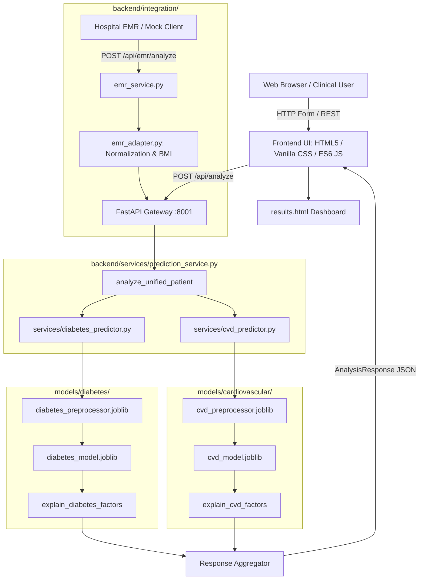

# I-HEART: Intelligent Health Evaluation And Risk Tracking

[](https://fastapi.tiangolo.com)
[](https://python.org)
[](https://scikit-learn.org)
[](#testing--validation)
[](#project-disclaimer)

> **A Dual-Disease Clinical Risk Screening Platform for Type 2 Diabetes and Cardiovascular Disease**  
> Powered by Machine Learning, a Unified Patient Intake Architecture, and Explainable AI (XAI).

---

## 1. Project Overview

Traditional clinical assessment workflows require independent, disjointed questionnaires and diagnostic protocols for metabolic and cardiovascular conditions. This creates duplicate data entry, clinician fatigue, and fragmented risk visibility.

**I-HEART (Intelligent Health Evaluation And Risk Tracking)** eliminates multi-form fragmentation through a **Unified Patient Input Architecture**. From a single patient record (demographics, physical measurements, vitals, laboratory panels, lifestyle, and history), specialized backend mappers isolate model-specific feature vectors, query independent machine learning pipelines, and synthesize dual risk probabilities into an integrated clinical dashboard.

```
                              UNIFIED PATIENT RECORD
                   [Demographics, Vitals, Labs, Physical, Lifestyle]
                                        │
                    ┌───────────────────┴───────────────────┐
                    ▼                                       ▼
        [Diabetes Feature Mapper]               [CVD Feature Mapper]
                    │                                       │
        [Fitted Preprocessor]                   [Fitted Preprocessor]
                    │                                       │
        [Trained Diabetes Model]                [Trained CVD Model]
                    │                                       │
                    └───────────────────┬───────────────────┘
                                        ▼
                           UNIFIED RISK DASHBOARD
```

---

## 2. Core Capabilities

- **Unified Patient Intake**: A single 6-category clinical intake schema (`UnifiedPatientProfile`) capturing demographics, anthropometrics, vitals, laboratory tests, lifestyle factors, and medical history.
- **Type 2 Diabetes Risk Prediction**: Calibrated logistic regression classifier tuned for clinical sensitivity ($ROC\text{-}AUC = 0.835$, $Recall = 0.778$).
- **Cardiovascular Disease (CVD) Risk Prediction**: Calibrated logistic regression classifier tuned for clinical sensitivity ($ROC\text{-}AUC = 0.747$, $Recall = 0.678$).
- **Explainable AI (XAI)**: Dynamic clinical factor attributions providing clear, human-understandable drivers of evaluated risk with built-in failure isolation.
- **Hospital / EMR Integration Foundation**: Dedicated adapter and normalization service for hospital/EMR-formatted records (`MockEMRPayload`), enabling automated BMI calculation and categorical alignment.
- **Strict Input Validation**: Pydantic schema validation enforcing biological boundaries, BMI mathematical consistency, and hemodynamic cross-field rules ($DBP < SBP$).
- **Dynamic Results Dashboard**: Responsive client dashboard featuring animated percentage gauges, risk badges (`Low`, `Moderate`, `High`), and clinical notes.
- **Unified Single-Port Local Architecture**: FastAPI serves both static frontend web assets and REST API endpoints on a single localhost port (`http://127.0.0.1:8001`).

---

## 3. System Architecture



### Architecture Data Flow
1. **Intake & Validation**: User enters patient measurements on the assessment page. The client calculates BMI in real time and validates ranges.
2. **API Dispatch**: Payload is transmitted as JSON matching `UnifiedPatientProfile` to `POST /api/analyze`.
3. **Feature Isolation**:
   - Diabetes predictor extracts 8 features (`gender`, `age`, `hypertension`, `heart_disease`, `smoking_history`, `bmi`, `HbA1c_level`, `blood_glucose_level`).
   - CVD predictor extracts 11 features (`age`, `gender`, `height`, `weight`, `ap_hi`, `ap_lo`, `cholesterol`, `gluc`, `smoke`, `alco`, `active`).
4. **Inference Execution**: Fitted scikit-learn `ColumnTransformer` preprocessors scale numerical features and encode categoricals. Serialized models calculate probabilities (`predict_proba`) and map risk levels.
5. **XAI Factor Derivation**: Feature contributions are derived against clinical thresholds. If an attribution routine fails, an exception handler returns fallback messages without interrupting the prediction.
6. **Unified Delivery**: Results are aggregated into an `AnalysisResponse` object and rendered on the client dashboard.

---

## 4. Technology Stack

- **Backend Framework**: [FastAPI](https://fastapi.tiangolo.com) `0.141.1` (Asynchronous Python REST API)
- **ASGI Web Server**: [Uvicorn](https://www.uvicorn.org) `0.52.4`
- **Data Validation & Schemas**: [Pydantic V2](https://docs.pydantic.dev) `2.13.5`
- **Machine Learning**: [scikit-learn](https://scikit-learn.org) `1.9.0`, [scipy](https://scipy.org) `1.18.1`, [joblib](https://joblib.readthedocs.io) `1.6.0`
- **Data Processing**: [pandas](https://pandas.pydata.org) `3.0.5`, [numpy](https://numpy.org) `2.5.2`
- **Frontend Stack**: Semantic HTML5, Vanilla CSS3 (custom clinical dark design system, glassmorphism), ES6+ JavaScript modules
- **Testing & Verification**: Python Standard Library (`unittest`, `urllib.request`), `requests` `2.34.2`

---

## 5. Project Directory Structure

```
e:\projects\I-HEART\
├── AGENTS.md                          # Authoritative project context & development guide
├── README.md                          # Main project documentation & repository guide
├── .gitignore                         # Environment, credentials, and cache exclusion rules
├── backend/                           # FastAPI backend application
│   ├── app.py                         # Application entrypoint & HTTP route handlers
│   ├── requirements.txt               # Backend dependencies
│   ├── schemas.py                     # Pydantic data schemas (UnifiedPatientProfile, etc.)
│   ├── integration/                   # Hospital / EMR Integration Foundation
│   │   ├── __init__.py                # Package initializer
│   │   ├── emr_schemas.py             # EMR data contracts (MockEMRPayload)
│   │   ├── emr_adapter.py             # Normalization, categorical mapping & BMI calculation
│   │   └── emr_service.py             # Privacy-safe EMR ingestion & prediction routing
│   └── services/                      # Prediction & XAI services
│       ├── __init__.py                # Package initializer
│       ├── cvd_predictor.py           # CVD feature mapper, model inference & XAI
│       ├── diabetes_predictor.py      # Diabetes feature mapper, model inference & XAI
│       └── prediction_service.py      # Dual prediction orchestrator
├── datasets/                          # Dataset storage and benchmark ingestion
│   ├── README.md                      # Dataset provenance and structure summary
│   ├── download_datasets.py           # Dataset verification & extraction script
│   ├── cardiovascular/                # CVD dataset (30,000 samples)
│   │   ├── raw/cardiovascular_dataset.csv
│   │   └── processed/                 # Train / test CSV splits (80/20)
│   └── diabetes/                      # Diabetes dataset (30,000 samples)
│       ├── raw/diabetes_prediction_dataset.csv
│       └── processed/                 # Train / test CSV splits (80/20)
├── docs/                              # Technical reports & system documentation
│   ├── README.md                      # Documentation table of contents
│   ├── feature_mapping.md             # Schema-to-feature mapping specification
│   ├── ml_architecture.md             # Machine learning system architecture
│   ├── model_evaluation.md            # Benchmark cross-validation & test metrics
│   ├── training_pipeline.md           # Reproducible training pipeline steps
│   ├── LOCAL_HOST_MERGE_REVIEW.md     # Single-port localhost consolidation review
│   ├── XAI_IMPLEMENTATION_REVIEW.md   # Explainable AI clinical attribution review
│   ├── EMR_INTEGRATION_REVIEW.md      # Hospital / EMR integration foundation review
│   ├── TESTING_VALIDATION_REVIEW.md   # Step 4 software testing & validation audit
│   ├── DESKTOP_UI_POLISH_REVIEW.md    # Step 6 desktop UI & accessibility audit
│   ├── MOBILE_RESPONSIVE_REVIEW.md    # Step 7 mobile & tablet responsive UI audit
│   ├── FINAL_VERIFICATION_REVIEW.md   # Step 8 pre-deployment final verification audit
│   ├── DOCUMENTATION_REVIEW.md        # Step 5 documentation verification audit
│   └── datasets/                      # Individual dataset documentation
│       ├── cardiovascular_dataset.md
│       └── diabetes_dataset.md
├── frontend/                          # Client web interface (Vanilla web stack)
│   ├── index.html                     # Landing page with methodology & live API monitor
│   ├── assessment.html                # Unified patient intake form
│   ├── results.html                   # Dual health risk dashboard
│   ├── css/
│   │   └── style.css                  # Complete custom CSS design system
│   └── js/
│       ├── app.js                     # Global navigation & backend health polling
│       ├── assessment.js              # Real-time BMI calculation & API submission
│       └── results.js                 # Gauge animations & factor badge rendering
├── ml/                                # Model training & evaluation code
│   ├── cardiovascular/                # CVD pipeline (preprocess, train, evaluate, predict)
│   └── diabetes/                      # Diabetes pipeline (preprocess, train, evaluate, predict)
├── models/                            # Serialized model artifacts & training metadata
│   ├── README.md                      # Model storage guide
│   ├── cardiovascular/                # Saved CVD model, preprocessor & metadata.json
│   └── diabetes/                      # Saved Diabetes model, preprocessor & metadata.json
├── notebooks/                         # Jupyter experimentation notebooks
│   └── README.md                      # Experimentation roadmap
└── tests/                             # Automated test suites (84 automated tests)
    ├── run_all_tests.py               # Master automated test suite runner
    ├── test_ml_pipeline.py            # ML model & preprocessor loading tests
    ├── test_validation.py             # Schema, boundary & hemodynamic validation tests
    ├── test_api_endpoints.py          # HTTP status codes & server stability tests
    ├── test_xai.py                    # Factor attribution & failure resilience tests
    ├── test_emr_integration.py        # EMR normalization & adapter tests
    ├── test_scenarios_e2e.py          # End-to-end clinical scenarios (A through F)
    ├── test_security_privacy.py       # Privacy logging, secret protection & CORS tests
    └── verify_scenarios.py            # Multi-scenario prediction verification
```

---

## 6. API Endpoints

The FastAPI backend serves both API endpoints and frontend assets on port `8001`.

| Method | Endpoint | Request Schema | Response Schema | Purpose |
| :--- | :--- | :--- | :--- | :--- |
| `GET` | `/api/health` | None | `{"status": str, "message": str}` | System operational liveness check |
| `POST` | `/api/analyze` | `UnifiedPatientProfile` | `AnalysisResponse` | Single patient intake returning dual risk predictions |
| `POST` | `/api/emr/analyze` | `MockEMRPayload` | `AnalysisResponse` | Normalizes hospital/EMR records and routes to ML models |
| `POST` | `/api/emr/test` | `MockEMRPayload` | `AnalysisResponse` | Dedicated test endpoint for validating EMR integration payloads |
| `GET` | `/docs` | None | HTML | Interactive Swagger / OpenAPI documentation |
| `GET` | `/` | None | HTML | Serves the frontend landing page |
| `GET` | `/assessment.html` | None | HTML | Serves the unified intake form |
| `GET` | `/results.html` | None | HTML | Serves the dual risk results dashboard |

### Example Request (`POST /api/analyze`)
```json
{
  "patient_id": "PAT-2026-001",
  "demographics": { "age": 52, "gender": "Male" },
  "physical": { "height_cm": 175.0, "weight_kg": 82.0, "bmi": 26.8 },
  "vitals": { "systolic_bp": 138, "diastolic_bp": 88, "heart_rate": 74 },
  "laboratory": {
    "glucose": 118.0,
    "hba1c": 6.1,
    "total_cholesterol": 215.0,
    "hdl": 44.0,
    "ldl": 138.0,
    "triglycerides": 165.0
  },
  "lifestyle": {
    "smoking": "Current",
    "physical_activity": "Sedentary",
    "alcohol": "Moderate"
  },
  "medical_history": {
    "hypertension": true,
    "existing_diabetes": false,
    "family_history_diabetes": true,
    "family_history_cvd": true
  }
}
```

---

## 7. Machine Learning Models

Both models were benchmarked across 4 candidate algorithms using 5-Fold Stratified Cross-Validation on 24,000 training samples, followed by hyperparameter tuning via `GridSearchCV` and evaluation on 6,000 untouched test samples.

### 7.1 Model Specifications
| Condition | Algorithm | Hyperparameters | Raw Features | Transformed Dims | Key Predictive Factors |
| :--- | :--- | :--- | :--- | :--- | :--- |
| **Type 2 Diabetes** | `LogisticRegression` | `C=0.01`, `solver='liblinear'`, `class_weight='balanced'` | 8 | 17 | Fasting glucose, HbA1c, BMI, age, hypertension |
| **Cardiovascular Disease** | `LogisticRegression` | `C=0.1`, `solver='lbfgs'`, `class_weight='balanced'` | 11 | 19 | Systolic/diastolic BP, cholesterol, glucose, smoking, age |

### 7.2 Untouched Test Set Evaluation (6,000 Samples Each)
| Model | Accuracy | Precision | Recall (Sensitivity) | F1-Score | ROC-AUC |
| :--- | :---: | :---: | :---: | :---: | :---: |
| **Diabetes Model** | `0.7455` | `0.3548` | **`0.7781`** | `0.4874` | **`0.8354`** |
| **Cardiovascular Model** | `0.6843` | `0.5854` | **`0.6777`** | `0.6282` | **`0.7470`** |

*Rationale:* In clinical risk screening, false negatives carry a severe clinical cost. Balanced Logistic Regression maximized sensitivity (Recall) and ROC-AUC while providing smooth, calibrated probability outputs.

---

## 8. Explainable AI (XAI)

The current XAI subsystem provides dynamic factor attributions tailored to evaluated patient inputs:
- **Biomarker Thresholds**: Translates numerical laboratory and vital measurements into clear clinical descriptions (e.g., `"Elevated fasting plasma glucose (185 mg/dL)"`, `"Stage 2 Hypertension (158/98 mmHg)"`, `"Active tobacco smoking behavior"`).
- **Directional Representation**: Distinguishes between optimal baseline parameters and elevated risk drivers.
- **Understandable Terminology**: Strips internal machine learning column names (e.g., `ap_hi`, `gluc`) in favor of standard clinical nomenclature.
- **Attribution Resilience**: Attribution functions are executed within isolated exception handlers; any attribution error safely defaults to a fallback note without crashing the underlying prediction.

---

## 9. Hospital / EMR Integration Foundation

> **Important Architecture Notice**: The EMR integration subsystem is an **integration foundation and mock workflow**. It is **NOT** connected to a live hospital database or production electronic health record (EHR) system.

- **Data Contracts**: [backend/integration/emr_schemas.py](file:///e:/projects/I-HEART/backend/integration/emr_schemas.py) defines `MockEMRPayload`, representing external hospital encounter structures.
- **Normalization Adapter**: [backend/integration/emr_adapter.py](file:///e:/projects/I-HEART/backend/integration/emr_adapter.py) normalizes unstructured hospital categories (`"Current Smoker"` $\to$ `"Current"`) and computes standard clinical BMI when omitted.
- **Privacy Safeguards**: Raw clinical parameters and patient identifiers are excluded from system logger outputs; only operational metadata is recorded.

---

## 10. Testing & Validation

The system has undergone a comprehensive software testing and hardening pass (Step 4), documented in [docs/TESTING_VALIDATION_REVIEW.md](file:///e:/projects/I-HEART/docs/TESTING_VALIDATION_REVIEW.md).

```
===========================================================================
FINAL TEST EXECUTION SUMMARY TABLE
===========================================================================
Test Group / Suite                                 | Pass  | Fail  | Skip
---------------------------------------------------------------------------
1. ML Pipelines (Diabetes & CVD)                   | 11    | 0     | 0
2. Input Validation & Clinical Boundaries          | 22    | 0     | 0
3. API Endpoints & Server Stability                | 16    | 0     | 0
4. Explainable AI (XAI) & Attribution Resilience   | 12    | 0     | 0
5. Hospital / EMR Integration Foundation           | 10    | 0     | 0
6. End-to-End Scenarios (A through F)              | 6     | 0     | 0
7. Security, Privacy & Reliability Safeguards      | 6     | 0     | 0
8. Scenario Verification Regression                | 1     | 0     | 0
---------------------------------------------------------------------------
OVERALL TOTALS                                     | 84    | 0     | 0
===========================================================================
FINAL STATUS: PASS (100% Passing, 0 Regressions)
```

To execute the entire test suite:
```bash
python tests/run_all_tests.py
```

---

## 11. Current Limitations

- **Academic Prototype**: Designed exclusively for research and academic demonstration; it is **not** a certified medical diagnostic device or FDA/CE-cleared tool.
- **No Live Hospital Connection**: Operates via synthetic schemas and test payloads; does not interface with live hospital networks or HL7/FHIR servers.
- **Single-Encounter Screening**: Evaluates point-in-time cross-sectional patient health records; does not track longitudinal time-series trends.
- **Local Host Architecture**: Currently runs as a single-port local developer deployment; cloud production deployment is intentionally deferred.

---

## 12. Local Development & Quick Start

### 12.1 Prerequisites
- Python `3.10+` (tested on Python `3.13`)
- Modern web browser (Chrome, Edge, Firefox)

### 12.2 Installation
```bash
# Clone the repository
git clone https://github.com/Mmyz03/I-HEART.git
cd I-HEART

# Install dependencies
pip install -r backend/requirements.txt
```

### 12.3 Starting the Unified Application
Run the FastAPI backend from the project root:
```bash
python backend/app.py
```
*Alternatively, using Uvicorn directly:*
```bash
python -m uvicorn app:app --app-dir backend --host 127.0.0.1 --port 8001
```

### 12.4 Accessing the Application
Once the server is running, access the platform locally:
- **Landing Page**: [http://127.0.0.1:8001/](http://127.0.0.1:8001/)
- **Assessment Form**: [http://127.0.0.1:8001/assessment.html](http://127.0.0.1:8001/assessment.html)
- **Results Dashboard**: [http://127.0.0.1:8001/results.html](http://127.0.0.1:8001/results.html)
- **Interactive API Docs (Swagger UI)**: [http://127.0.0.1:8001/docs](http://127.0.0.1:8001/docs)

---

## Project Disclaimer

> **ACADEMIC DEMONSTRATION NOTICE**: I-HEART is an academic research prototype developed for educational and experimental demonstration. It is not intended for primary clinical diagnosis, emergency medical decisions, or replacing professional clinical judgment.
