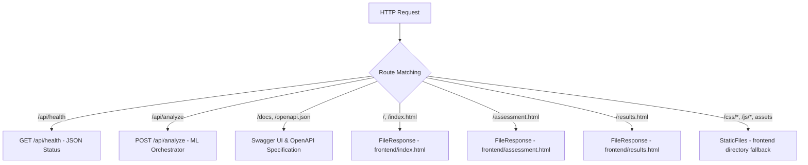

# Local Host Merge Review

## Changes Made
1. **Single Localhost Port Consolidation:**
   - Consolidated frontend serving and FastAPI API routing onto a single host and port: `http://localhost:8001/` (or `http://127.0.0.1:8001/`).
   - Terminated the separate static file server that was previously running on port 3000 (`python -m http.server 3000 --directory frontend`).
   - The application now requires only one command to launch both frontend and backend:
     ```bash
     python -m uvicorn app:app --app-dir backend --host 127.0.0.1 --port 8001
     ```

2. **FastAPI Application Updates ([backend/app.py](file:///e:/projects/I-HEART/backend/app.py)):**
   - Imported `StaticFiles` from `fastapi.staticfiles` and `FileResponse` from `fastapi.responses`.
   - Resolved the relative path to `frontend/` directory from the backend package directory.
   - Added explicit GET routes for `/`, `/index.html`, `/assessment.html`, and `/results.html`.
   - Mounted `frontend/` as static files at root (`app.mount("/", StaticFiles(directory=str(frontend_dir), html=True), name="frontend")`).
   - Placed static file mounting *after* all API endpoints and explicit page routes to ensure API routes (`/api/health`, `/api/analyze`, `/docs`, `/openapi.json`) are never intercepted.

3. **Frontend Dynamic Origin Resolution ([frontend/js/app.js](file:///e:/projects/I-HEART/frontend/js/app.js) and [frontend/js/assessment.js](file:///e:/projects/I-HEART/frontend/js/assessment.js)):**
   - Configured `API_BASE_URL` to dynamically resolve from `window.location.origin` with a fallback to `http://127.0.0.1:8001`.
   - Ensures zero CORS or origin-mismatch issues whether the clinician accesses the platform via `http://localhost:8001/` or `http://127.0.0.1:8001/`.

---

## FastAPI Serving Configuration
The unified serving pattern in [backend/app.py](file:///e:/projects/I-HEART/backend/app.py) follows this strict route priority:



---

## URLs Verified
The following endpoints were verified against the running server process:

| URL | HTTP Method | Expected Content | Verified Status |
| :--- | :--- | :--- | :--- |
| `http://127.0.0.1:8001/` | `GET` | Landing page HTML ([index.html](file:///e:/projects/I-HEART/frontend/index.html)) | **200 OK** (27,572 bytes) |
| `http://127.0.0.1:8001/index.html` | `GET` | Landing page HTML direct path | **200 OK** (27,572 bytes) |
| `http://127.0.0.1:8001/assessment.html` | `GET` | Unified assessment form ([assessment.html](file:///e:/projects/I-HEART/frontend/assessment.html)) | **200 OK** (22,892 bytes) |
| `http://127.0.0.1:8001/results.html` | `GET` | Results dashboard ([results.html](file:///e:/projects/I-HEART/frontend/results.html)) | **200 OK** (12,808 bytes) |
| `http://127.0.0.1:8001/css/style.css` | `GET` | Design system stylesheet | **200 OK** (`text/css`) |
| `http://127.0.0.1:8001/js/app.js` | `GET` | Global navigation & health check script | **200 OK** (`text/javascript`) |
| `http://127.0.0.1:8001/js/assessment.js` | `GET` | Intake form validation & BMI script | **200 OK** (`text/javascript`) |
| `http://127.0.0.1:8001/js/results.js` | `GET` | Risk gauge & dashboard rendering script | **200 OK** (`text/javascript`) |
| `http://127.0.0.1:8001/api/health` | `GET` | `{"status":"ok","message":"..."}` | **200 OK** (`application/json`) |
| `http://127.0.0.1:8001/docs` | `GET` | FastAPI Swagger UI | **200 OK** (`text/html`) |
| `http://127.0.0.1:8001/openapi.json` | `GET` | OpenAPI 3.1.0 schema specification | **200 OK** (`application/json`) |

---

## Prediction Tests
1. **End-to-End Scenario Verification ([tests/verify_scenarios.py](file:///e:/projects/I-HEART/tests/verify_scenarios.py)):**
   - **Low Risk Scenario (`PAT-LOW-01`):** Diabetes Risk: 4% (Low) | CVD Risk: 6% (Low).
   - **Moderate Risk Scenario (`PAT-MOD-02`):** Diabetes Risk: 46% (Moderate) | CVD Risk: 86% (High).
   - **High Risk Scenario (`PAT-HIGH-03`):** Diabetes Risk: 94% (High) | CVD Risk: 99% (High).
   - Result: All 3 clinical scenarios executed against `POST http://127.0.0.1:8001/api/analyze` and passed with zero errors.

2. **Automated ML Unit Tests ([tests/test_ml_pipeline.py](file:///e:/projects/I-HEART/tests/test_ml_pipeline.py)):**
   - Artifact loading (models + preprocessors): **PASS**
   - Feature mapping (Diabetes & CVD): **PASS**
   - Prediction service execution: **PASS**
   - Dual-disease orchestrator integration: **PASS**
   - Result: 7/7 tests passed.

---

## Frontend Verification
- Tested live API health status polling from `app.js`: returned `status: ok` and updated UI status pill to active on port 8001.
- Form inputs on [assessment.html](file:///e:/projects/I-HEART/frontend/assessment.html) correctly construct the 6-part `UnifiedPatientProfile` payload and submit via HTTP `POST` to `/api/analyze`.
- Demo autofill profiles ("Load Moderate Risk Sample" and "Load High Risk Sample") load data cleanly.
- Real-time BMI calculation correctly calculates BMI and updates risk categories.
- Predictions returned by the backend are stored into `sessionStorage` (`current_health_analysis`) and displayed on [results.html](file:///e:/projects/I-HEART/frontend/results.html) with animated meters and contributing clinical factors.

---

## Issues / Limitations
- **No Issues Found:** The static file mount does not interfere with API endpoints, OpenAPI documentation, or HTML pages.
- **Port Requirement:** The application requires port `8001` to be available. If port 8001 is occupied by an orphaned process, it must be released before starting Uvicorn.

---

## Confirmation
**CONFIRMED:** The I-HEART system now runs entirely using a **single local FastAPI server on port 8001** (`http://localhost:8001/` or `http://127.0.0.1:8001/`). There is no longer any need to run a secondary server on port 3000.
