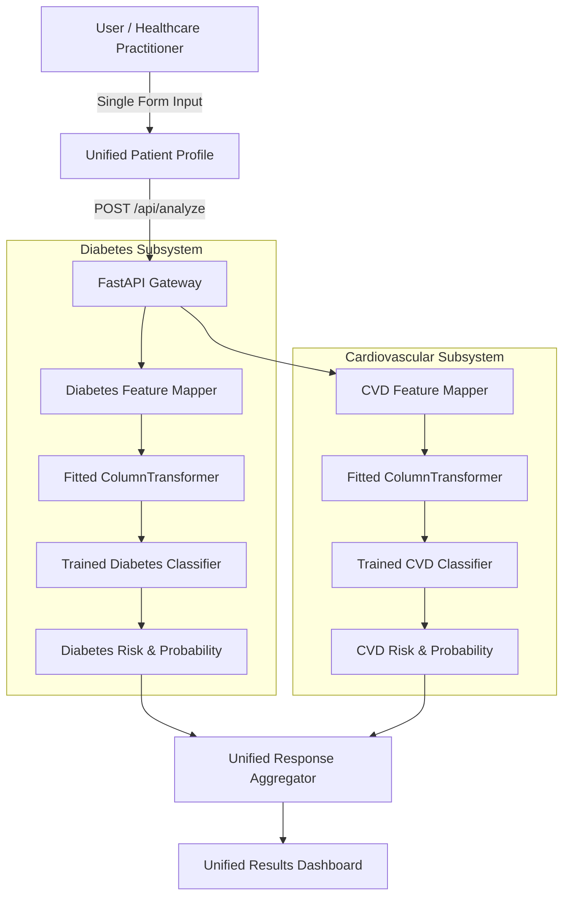

# Machine Learning Architecture

## 1. High-Level Architectural Flow

The system employs a **Unified Patient Input Architecture** that branches into **two independent Machine Learning pipelines** before re-converging into a unified risk dashboard:

## 2. Core Architectural Principles

1. **Single Intake Contract**: The user enters patient information exactly once. There are no separate forms for diabetes and CVD.
2. **Strict Feature Isolation**: Each disease pipeline extracts and processes *only* the specific features required by its mathematical model.
3. **Reproducibility & Serialization**: Both pipelines use scikit-learn `Pipeline` and `ColumnTransformer` objects serialized via `joblib`, ensuring exact training-time preprocessing transforms are applied at inference time without duplicate code.
4. **Data Leakage Immunity**: Feature imputation, scaling, and categorical encoding are fitted strictly on training data splits.
5. **Calibrated Model Risk Estimates**: Models output probability scores (`predict_proba`) converted to standard clinical screening risk bands (`Low`, `Moderate`, `High`).
