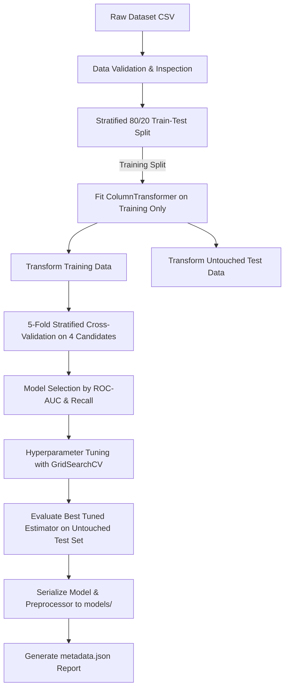

# Training Pipeline Documentation

## 1. Overview
The training pipelines are completely independent, modular, and reproducible. Both pipelines adhere to the following sequence:



## 2. Leakage Prevention Protocol
- **Train/Test Splitting**: The dataset is split *before* any numerical scaling or categorical one-hot encoding occurs.
- **Preprocessor Fitting**: `ColumnTransformer.fit_transform()` is executed exclusively on `X_train`.
- **Test Set Isolation**: `X_test` is transformed via `ColumnTransformer.transform()`.
- **Model Tuning**: `GridSearchCV` evaluates only within the training split folds. The test split is touched only once for the final verification metrics.

## 3. Execution Commands
To retrain both models from scratch:

```bash
# Ingest raw benchmark datasets
py datasets/download_datasets.py

# Train Diabetes pipeline
py ml/diabetes/train.py

# Train Cardiovascular Disease pipeline
py ml/cardiovascular/train.py

# Verify model evaluation
py ml/diabetes/evaluate.py
py ml/cardiovascular/evaluate.py
```
